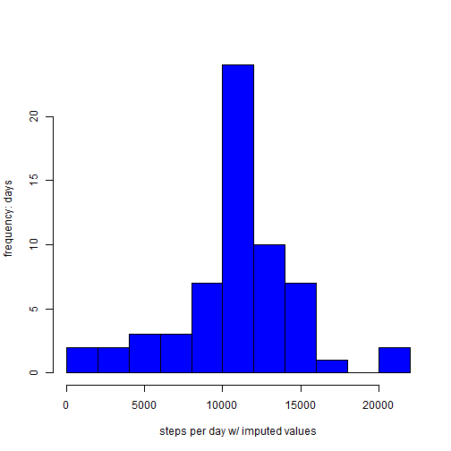

This assignment makes use of data from a personal activity monitoring device. This device collects data at 5 minute intervals through out the day. The data consists of two months of data from an anonymous individual collected during the months of October and November, 2012 and include the number of steps taken in 5 minute intervals each day.

Original data downloaded from [link](https://d396qusza40orc.cloudfront.net/repdata%2Fdata%2Factivity.zip)
at 2016-05-10 18:06:01 CDT.

The variables included in this dataset are:

  - steps: Number of steps taking in a 5-minute interval (missing values are coded as NA)  
  - date: The date on which the measurement was taken in YYYY-MM-DD format  
  - interval: Identifier for the 5-minute interval in which measurement was taken  

Reading in the data...

```r
data = read.csv("./repdata_data_activity/activity.csv", na.strings = "NA")
data$steps = as.numeric(data$steps)
```

Histogram of the total number of steps taken each day...

```r
dailySteps = with(data, tapply(steps, date, sum, na.rm = TRUE))
hist(dailySteps, breaks = 10, col = "blue", xlab = "steps per day", ylab = "frequency: days", main = "")
```


Mean and median number of steps taken each day...

```r
mean(dailySteps)
```

```
## [1] 9354.23
```

```r
median(dailySteps)
```

```
## [1] 10395
```

Time series plot of the average number of steps taken...

```r
plot(dailySteps, type = "l", ylab = "total steps", xlab = "daily counts: Oct - Nov 2012", axes = FALSE, col = "blue", lwd = 2)
```


The 5-minute interval that, on average, contains the maximum number of steps...

```r
meanInt = with(data, tapply(steps, interval, mean, na.rm = TRUE))
meanInt[which(meanInt == max(meanInt))]
```

```
##      835 
## 206.1698
```

How many records are NA for step count?

```r
table(is.na(data$steps))
```

```
## 
## FALSE  TRUE 
## 15264  2304
```

Prepare to impute NA values using mean for interval...

```r
meanInt = data.frame(unique(data$interval),meanInt)
colnames(meanInt) = c("interval", "avgsteps")
meanInt$avgsteps = as.numeric(meanInt$avgsteps)
```

Merge mean interval data with original dataframe...

```r
library(plyr)
dataImpute = join(data, meanInt, by = "interval", type = "left", match = "all")
```

Add column for imputed values, replacing NAs with interval average steps...

```r
dataImpute$newSteps = dataImpute$steps
stepsNA = is.na(dataImpute$newSteps)
dataImpute$newSteps[stepsNA] = dataImpute$avgsteps[stepsNA]
head(dataImpute)
```

```
##   steps       date interval  avgsteps  newSteps
## 1    NA 2012-10-01        0 1.7169811 1.7169811
## 2    NA 2012-10-01        5 0.3396226 0.3396226
## 3    NA 2012-10-01       10 0.1320755 0.1320755
## 4    NA 2012-10-01       15 0.1509434 0.1509434
## 5    NA 2012-10-01       20 0.0754717 0.0754717
## 6    NA 2012-10-01       25 2.0943396 2.0943396
```

Histogram of the total number of steps taken each day after imputing...

```r
newSteps = with(dataImpute, tapply(newSteps, date, sum, na.rm = TRUE))
hist(newSteps, breaks = 10, col = "blue", xlab = "steps per day w/ imputed values", ylab = "frequency: days", main = "")
```



Adding weekday/weekend variable...

```r
dataImpute$date = as.Date(dataImpute$date)
weekpart = weekdays(dataImpute$date)
dataImpute = data.frame(dataImpute, weekpart)
dataImpute$weekpart = sub("[MTWF].*", "weekday", dataImpute$weekpart)
dataImpute$weekpart = sub("S.*", "weekend",dataImpute$weekpart)
```

Panel plot comparing the average number of steps taken per 5-minute interval: weekdays v. weekends...

```r
wkdy = which(dataImpute$weekpart == "weekday")
wknd = which(dataImpute$weekpart == "weekend")
par(mfcol = c(2,1))
plot1 = plot(dataImpute$interval[wkdy], dataImpute$newSteps[wkdy], type = "l", ylab = "total steps", xlab = "weekdays: Oct - Nov 2012 ", axes = FALSE, col = "blue")
plot2 = plot(dataImpute$interval[wknd], dataImpute$newSteps[wknd], type = "l", ylab = "total steps", xlab = "weekends: Oct - Nov 2012 ", axes = FALSE, col = "blue")
```


